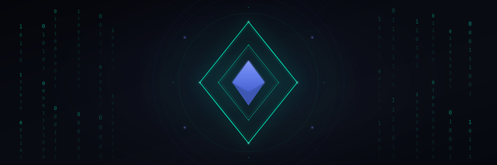

<h1 align="center">leanVM</h1>


<p align="center">
  
</p>

Minimal hash-based zkVM, for a Post-Quantum Ethereum.

<p align="center">
  <a href="https://github.com/leanEthereum/leanVM/releases/download/doc-latest/leanVM.pdf"></a>
  <a href="./python-verifier/verifier.py"></a>
</p>

<p align="center">
  <a href="#xmss-aggregation"></a>
  <a href="#sphincs-aggregation"></a>
  <a href="#recursion"></a>
</p>

Warning: highly experimental.

leanVM was originally designed over the [KoalaBear prime](https://crates.io/crates/p3-koala-bear) and [Poseidon](https://eprint.iacr.org/2019/458), still available in the branch [koalabear]([koalabear](https://github.com/leanEthereum/leanVM/tree/koalabear)); it is being rewritten over binary fields and BLAKE2s.

# Benchmarks

Machine: Mac M4 Max

### XMSS aggregation

The XMSS parameters are specified in [XMSS.pdf](https://github.com/leanEthereum/leanVM/releases/download/doc-latest/XMSS.pdf).

```bash
cargo run --release -- aggregate --xmss 900 --log-inv-rate 1 --repeat 3
```

```
aggregation, 900 XMSS signatures
  cycles (VM steps)           : 1,571,001 = 2^20.583
    details                   : DEREF 2^18.978 (32.9%)  SET 2^18.525 (24.0%)  MUL 2^18.199 (19.2%)  BLAKE2S 2^16.989 (8.3%)  XOR 2^16.979 (8.2%)  JUMP 2^16.839 (7.5%)  MEMORY 2^21.304  TOTAL_COMMITTED 2^26.2
  proof size                  : 296.1 KiB
  proving time                : 0.818 s ± 3.6%      peak memory 8.997 GiB
  per signature               : 1,100.889 signatures/s
  verifying                   : 0.0168 s
```

### SPHINCS aggregation

The SPHINCS parameters are specified in [SPHINCS.pdf](https://github.com/leanEthereum/leanVM/releases/download/doc-latest/SPHINCS.pdf).

```bash
cargo run --release -- aggregate --sphincs 245 --log-inv-rate 1 --repeat 3
```

```
aggregation, 245 SPHINCS signatures
  cycles (VM steps)           : 2,629,855 = 2^21.327
    details                   : DEREF 2^19.438 (27.0%)  XOR 2^19.239 (23.5%)  MUL 2^19.215 (23.1%)  SET 2^18.833 (17.8%)  BLAKE2S 2^16.992 (5.0%)  JUMP 2^16.543 (3.6%)  MEMORY 2^21.794  TOTAL_COMMITTED2^26.667
  proof size                  : 320.8 KiB
  proving time                : 1.082 s ± 1.8%      peak memory 12.538 GiB
  per signature               : 226.511 signatures/s
  verifying                   : 0.0155 s
```

### Recursion


```bash
cargo run --release -- recursion --n 2 --xmss-per-leaf 900 --log-inv-rate 2 --repeat 3
```

```
recursion 2→1, over leaves of 900 XMSS signatures
  cycles (VM steps)           : 686,085 = 2^19.388
    details                   : MUL 2^17.715 (31.4%)  DEREF 2^17.697 (31.0%)  XOR 2^17.396 (25.1%)  SET 2^15.3 (5.9%)  JUMP 2^14.732 (4.0%)  BLAKE2S 2^14.169 (2.7%)  MEMORY 2^19.679  TOTAL_COMMITTED 2^24.66
  proof size                  : 206.3 KiB
  proving time                : 0.394 s ± 6.3%      peak memory 10.378 GiB
  verifying                   : 0.0146 s
```

### Fibonacci


```bash
cargo run --release -- fibonacci --n 2000000 --log-inv-rate 1 --repeat 3
```

```
Fibonacci (in the exponent, i.e. modulo 2^64 - 1), N = 2,000,000
  cycles (VM steps)           : 2,127,880
    details                   : MUL 2^20.936 (98.7%)  DEREF 2^13.967 (0.8%)  SET 2^12.552 (0.3%)  JUMP 2^10.968 (0.1%)  XOR 2^10.966 (0.1%)  MEMORY 2^20.957  TOTAL_COMMITTED 2^25.263
  proof size                  : 285.4 KiB
  proving                     : 0.4 s ± 4.1%   5,320,879 cycles/s      peak memory 5.14 GiB
  verifying                   : 0.00294 s
```

### Batch proving BLAKE2s

```bash
BENCH_REPEAT=3 BENCH_COOLDOWN=2 FLOCK_N_LOG=18 cargo test --release --package flock --test batch_proving_hashes -- hash_batch_prove_verify --exact --nocapture --include-ignored
```

```
Flock BLAKE2s batch proving, 262,144 compressions (2^18 slots)
  setup (preprocessing, excluded) :      0.0 ms
  witness-gen                     :     64.1 ms ± 8.1%   10.6%
  commit                          :    100.5 ms ± 0.7%   16.6%
  zerocheck                       :    243.6 ms ± 7.5%   40.3%
  lincheck                        :     20.7 ms ± 16.6%   3.4%
  pcs opening                     :    175.6 ms ± 2.4%   29.1%
  other                           :      0.0 ms           0.0%
  ------------------------------------------
  prove TOTAL (witness excluded)  :    540.5 ms ± 4.6%   89.4%
  verify                          :      1.9 ms
  throughput                      :        485,033 compressions/s ± 4.6%
  (~3322.1 XMSS/s equivalent at 146 compressions/signature)
```

## Security

- 128-bit (LDR Johnson, no proximity gaps conjecture)

## Snark machinery

- Binary field of 192 bits (tower of degree 3 over the 64 bit field)
- PCS: [WHIR](https://eprint.iacr.org/2024/1586) (aka [Ligerito](https://eprint.iacr.org/2025/1187))
- Proving BLAKE2s by [Flock](https://github.com/succinctlabs/flock/tree/main)
- RingSwitching, M3 arithmetisation, (and more) by [Binius](https://github.com/IrreducibleOSS/binius) / [Binius64](https://github.com/binius-zk/binius64) (see [DP23](https://eprint.iacr.org/2023/1784) and [DP24](https://eprint.iacr.org/2024/504))
